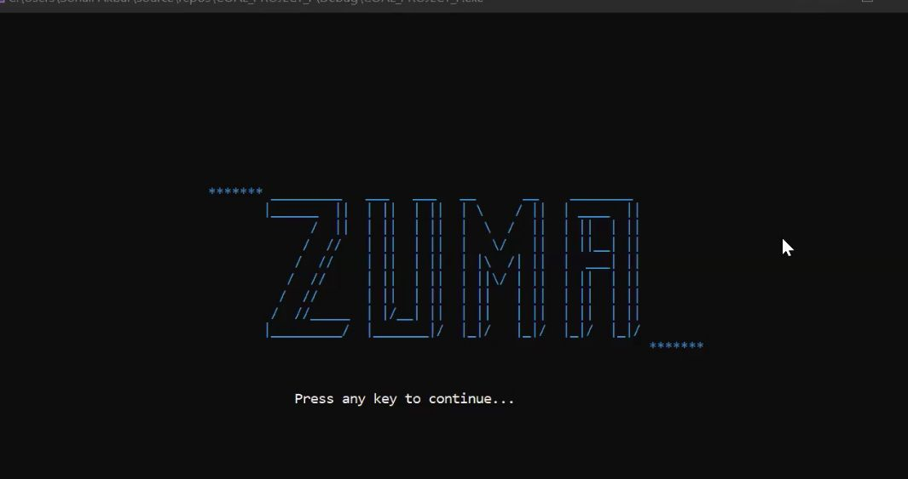
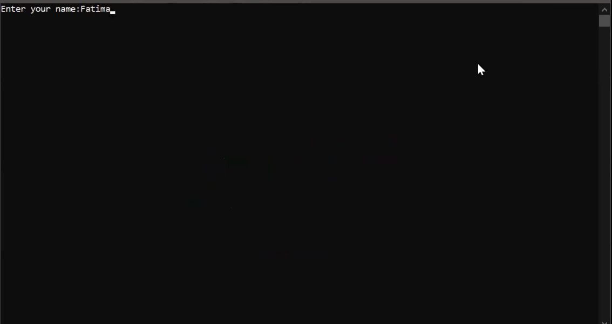
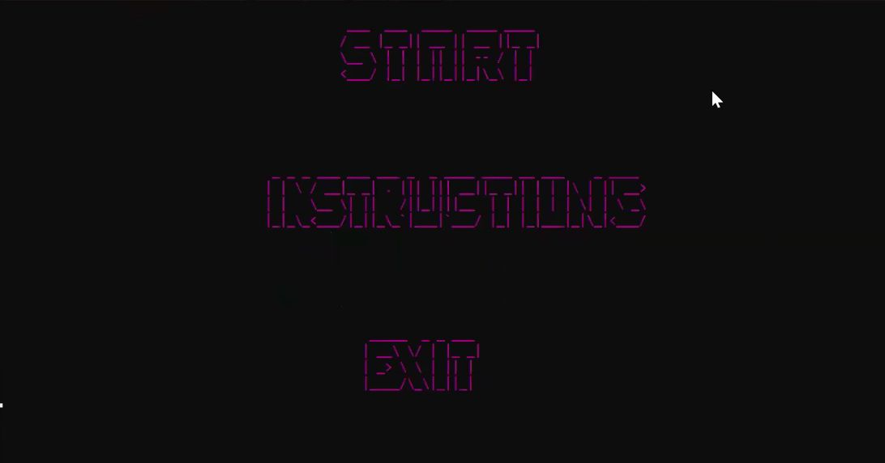
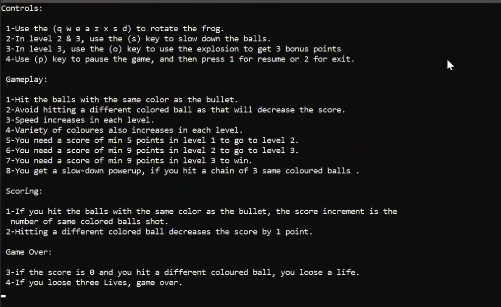
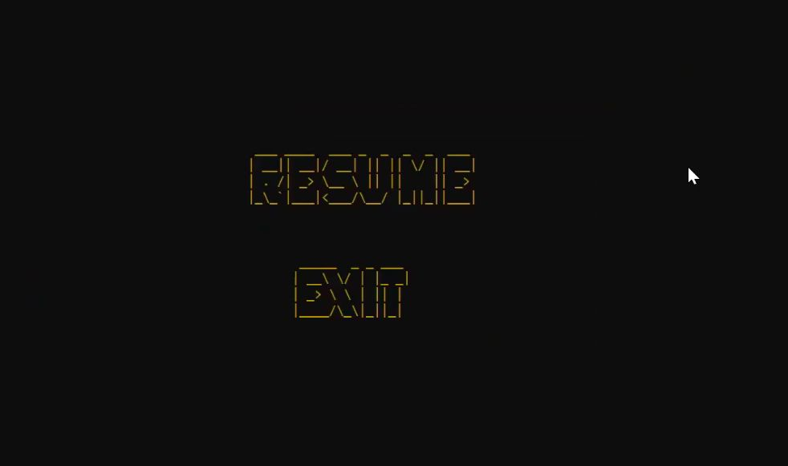
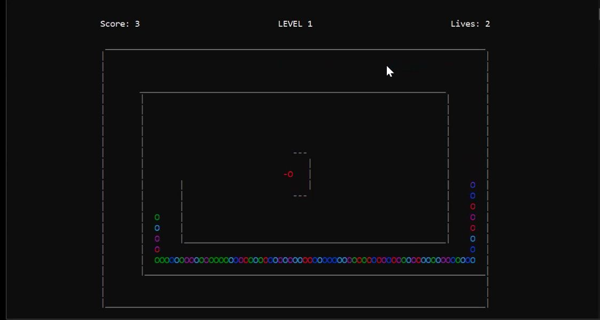
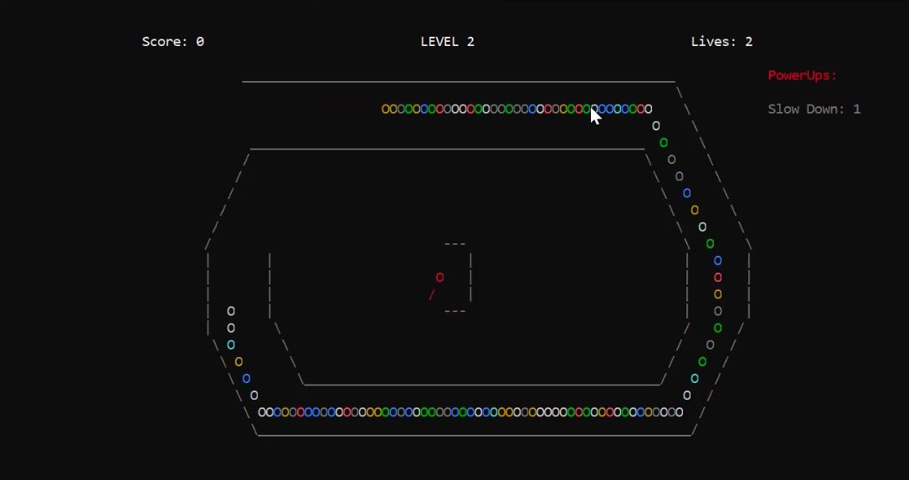
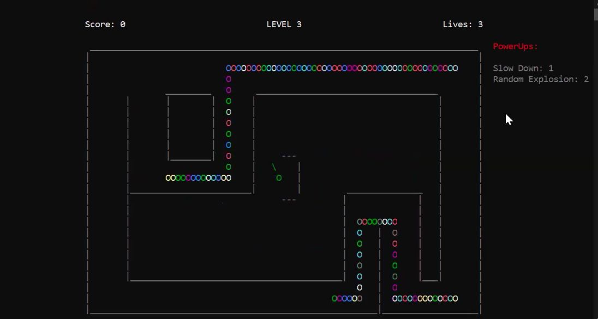

# Zuma-Balls (Assembly Language Project)

This project is a clone of the popular Zuma Balls game using x86 assembly language. It features a text-based or graphical interface and incorporates sound effects for a more immersive experience.

---

## Features
### Welcome Screen
- Welcome screen displays the title of the project.
- Upon pressing any key it proceeds to the next screen where the players can input their names.
    
    
### Game Menu
- Navigate through options like starting the game, viewing instructions, or exiting.
    
### Instructions 
- the instructions explain how the game is played and the scoring mechanisms.
  
### Pause Screen
- Players can pause the game at any point to take a break.
  
## Gameplay
### Level 1
- Keep track of remaining lives during gameplay.
- The game starts with a straightforward ball path.
- Smooth frog rotation to aim at the balls.
- Launch balls to create color-matching combinations.
- Slow speed of balls
  
### Level 2
- Intricate paths to make the game more challenging.
- Additional colors.
- Balls disappear when more than one same colored balls are shooted.
- Power-Ups (e.g., Slow-Down Ball): Introduces power-ups to slow down the game for some time.
- Faster speed of balls.
  
### Level 3
- Advanced paths featuring tunnels add a new dimension to the challenge.
- Additional ball colors and gaps make the gameplay more dynamic.
- Additional Power-Ups (e.g., Explosion Ball): Explosive power-ups for additional score.
- Fastest speed of balls.
  
## End Screen
- A final score display to conclude the game.
## Winning Screen

## Scoring
- The program does filehandling and writes the name, level and score of the players in a .txt file.
---
## Technologies Used
- **Programming Language:** Assembly (x86 architecture)
- **Libraries:**
  - `Irvine32.inc`: Provides macros and functions for ease of assembly programming.
  - `winmm.lib`: Used for sound effects.
  - `macros.inc`: Includes helpful macros to simplify assembly programming.

## Requirements:
   - Windows operating system (compatible with `winmm.lib`).
   - Irvine setup.
   - MASM (Microsoft Macro Assembler) or any compatible assembler.

## License
This project is licensed under the [MIT License](LICENSE).
